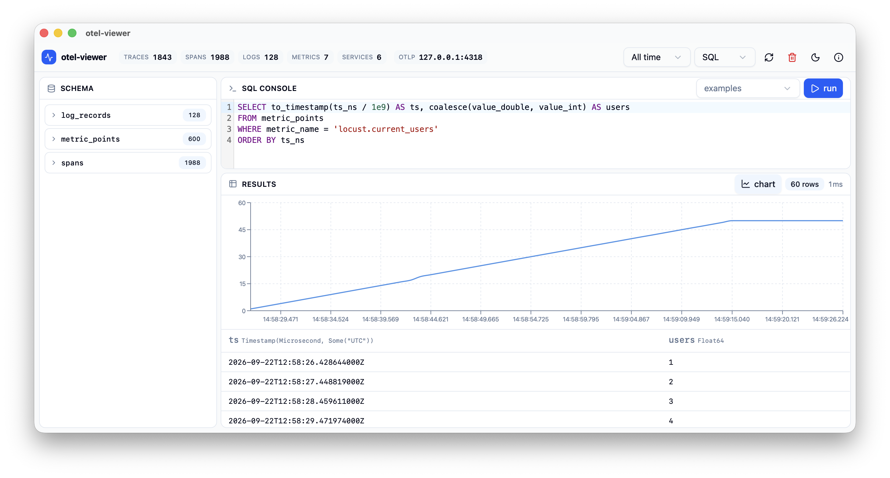

# otel-viewer

Self-hosted **OTLP collector** with a built-in telemetry viewer: one binary
receives traces, metrics and logs over OTLP/gRPC, stores them in embedded
**DuckDB**, and serves a **web UI** + **REST query API**. No external
services.

```
OTLP exporters ──gRPC :4317──▶ otel-viewer ──▶ DuckDB
                                   │
                        HTTP :6666 ┤── REST API (/api/*)
                                   └── web UI (embedded)
```

Also available as a **native desktop app** (Tauri 2) — same stack, one
window, persistent local database. See [src-tauri/README.md](src-tauri/README.md).

Docs: <https://stivio00.github.io/otel-viewer/> (source in [docs/](docs/)).

## Features

- **Traces** — waterfall view, service/error filters, span detail
- **Logs** — severity filter, full-text search, trace correlation
- **Metrics** — gauges, sums, histograms, exponential histograms, summaries;
  per-series line charts
- **SQL console** — read-only SQL against the live DuckDB, with automatic
  time-series charting of results
- **Storage info** — file size, block usage, per-table sizes (header `(i)`)
- **Reset** — delete all telemetry data from the UI
- Demo data seeding, CORS-free same-origin UI, live auto-refresh

## Screenshots

**Main view** — traces, logs and metrics side by side with live counters:


**Metric detail** — per-series line chart plus histogram buckets:


**SQL console** — auto line chart on the `locust.current_users` gauge:



## Install (desktop app)

Prebuilt binaries for macOS (`.dmg`) and Windows (`.exe` installer) are
attached to every [release](https://github.com/stivio00/otel-viewer/releases).
Package managers: `brew install --cask otel-viewer` (macOS) and
`winget install Stivio00.otel-viewer` (Windows) — details in the
[installation docs](https://stivio00.github.io/otel-viewer/installation.html).

## Quickstart (server)

```bash
cargo run -- --seed-demo     # UI/API on http://localhost:6666, OTLP on :4317
```

Point any OTLP/gRPC exporter at `localhost:4317`. For a ready-made source of
realistic telemetry see [locust-test/](locust-test/README.md).

### CLI options

```
-f, --file <PATH>    DuckDB file (default: in-memory)
-h, --host <HOST:PORT>  web UI / REST API (default: localhost:6666)
-o, --otlp <HOST:PORT>  OTLP/gRPC receiver (default: 0.0.0.0:4317)
    --seed-demo      seed demo telemetry when the database is empty
```

Ports fall back automatically (6666→6670, 4317→4321, then OS-assigned);
actual addresses are in `GET /api/health`.

## Quickstart (desktop app)

```bash
pnpm install && pnpm -C web install
pnpm tauri build        # → src-tauri/target/release/bundle/ (app/dmg/nsis)
```

## Development

```bash
cargo check && cargo test       # rust
pnpm -C web build               # web UI (tsc + vite → web/dist)
cargo run -- --seed-demo        # collector on :6666
pnpm -C web dev                 # vite on :5173 (proxies /api → :6666)
```

See [AGENTS.md](AGENTS.md) for repository conventions and gotchas.

## REST API

| Endpoint | Description |
|---|---|
| `GET /api/health` | status, version, db file, OTLP address |
| `GET /api/stats` | row counts, services, time range |
| `GET /api/dbstats` | DuckDB storage stats (blocks, sizes, memory) |
| `GET /api/traces` / `GET /api/traces/{id}` | trace list / detail |
| `GET /api/logs` | log list with filters |
| `GET /api/metrics` / `GET /api/metrics/{name}` | metric summaries / points |
| `GET /api/services` / `GET /api/schema` | services / schema |
| `POST /api/query` | read-only SQL (`{"sql": "..."}`) |
| `POST /api/reset` | delete all telemetry data |

Full reference: [docs/rest-api.md](docs/rest-api.md).
