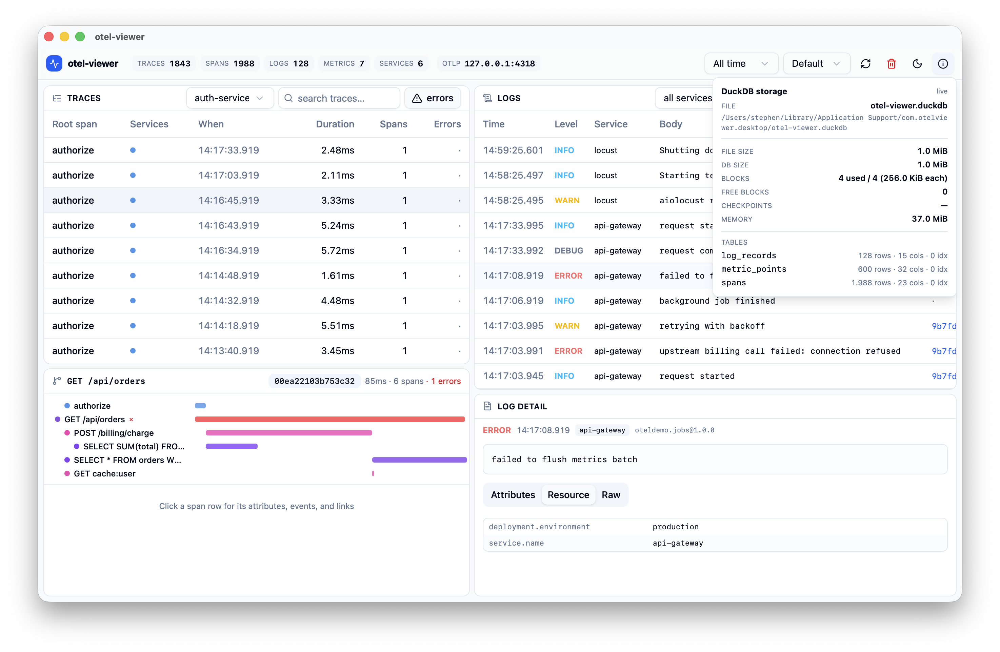
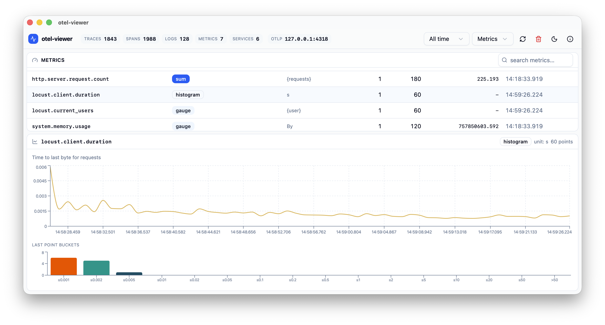

# Web UI

The UI is a React 19 SPA (Vite + Tailwind 4 + recharts) served by the
collector itself — same origin as the API, so no CORS setup is ever needed.

## Panels

| Panel | What it shows |
|---|---|
| **Traces** | trace list with duration/error sparkline filters; click for the waterfall and span detail (attributes, events, links, resources) |
| **Logs** | log stream with severity colors, full-text search and trace correlation |
| **Metrics** | metric list (type, unit, last value); click one for per-series line charts, histogram buckets, summary quantiles |
| **SQL** | read-only SQL console with auto charting — see [SQL Console & Charts](sql-console.md) |
| **Schema** | tables, columns and row counts |



The metric detail view draws a line chart per series and, for histograms,
the bucket distribution of the latest point:



Layout presets (Default / Traces / Logs / Metrics / SQL) and a time-range
selector live in the header.

## Header controls

- **traces/spans/logs/metrics/services** — live counters (5s poll)
- **otlp** — the OTLP/gRPC endpoint; click to copy
- time range + layout preset selectors
- **auto-refresh selector** — refetch everything on an interval
  (off / 100ms / 500ms / 1s / 2s / 5s / 10s)
- **refresh** — refetch everything now
- **trash** — reset the database: click once to arm (button turns red, 4s
  window), click again to delete all telemetry data. `POST /api/reset`.
- **sun/moon** — theme toggle (persisted)
- **(i)** — DuckDB storage info: file path and size, database size, block
  usage (used/total/free, block size), checkpoint count, memory usage, and
  per-table row estimates with column and index counts. Updates live while
  open.

## Development

```bash
cargo run -- --seed-demo   # collector: UI/API on :6666, OTLP on :4317
pnpm -C web dev            # vite on :5173, proxies /api to :6666
```

The vite dev server proxies `/api/*` to the collector, so the browser only
ever sees one origin. Hot reload applies to UI code; telemetry keeps flowing
into the collector.

Build the UI into `web/dist` (embedded into release binaries via rust-embed):

```bash
pnpm -C web build
```

## Crash safety

The layout is wrapped in an error boundary: if a panel throws during render,
the app shows a crash card with the error and a reload button instead of a
blank window.
